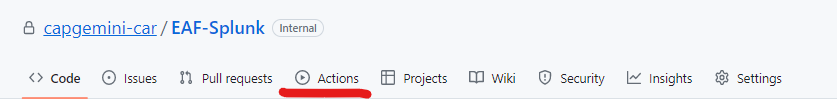
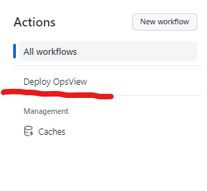
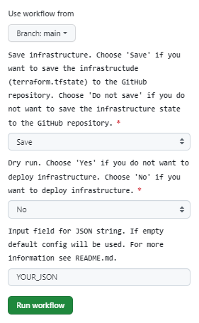
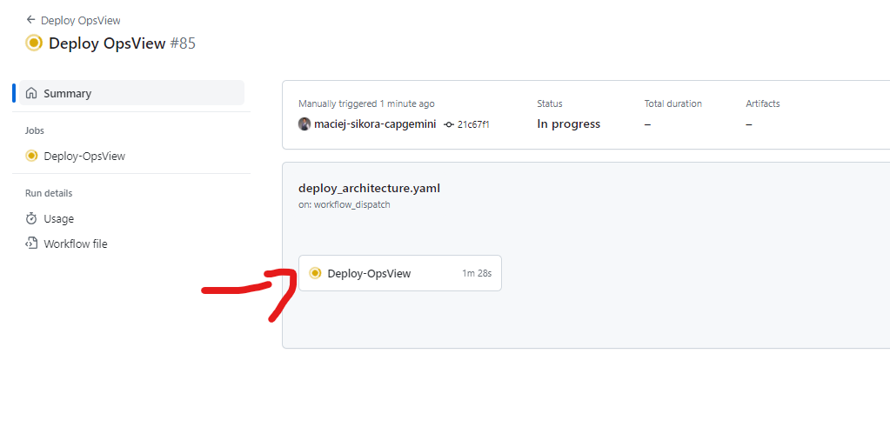
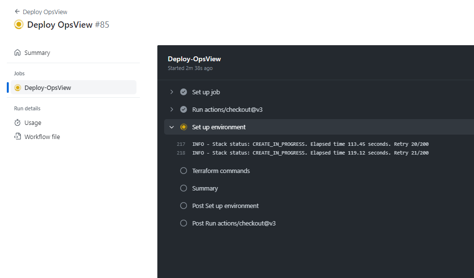

# Documentation

## Overview

This repository contains tools and scripts to deploy and configure infrastructure for OspView tool.
To correcty run the whole process, you need to set up correct role in designated account and provide correct input JSON file. Please read carefully the following documentation.

Framework and tooles used in this repository are:

1. Terraform
2. CloudFormation
3. Bash
4. Python
5. Ansible

The whole process is devided into several main steps:

1. Create missing architecture components. [CloudFormation, Python]
2. Create OpsView instances. [Terraform]
3. Configure OpsView instances. [Ansible]

## Role Setup

Navigate to folder `EAF-OpsView/scripts/github_policy_role`, read the `README.md` file and follow the instructions.

## Input JSON

Navigate to folder `EAF-OpsView/scripts/json_configuration`, read the `README.md` file and follow the instructions.

## Usage

Assuming you have created and configured the role in AWS, as well as prepared your input JSON file, you can deploy the infrastructure by executing following steps:

1. On your cloned repository pange on GitHub, navigate to `Actions` tab. 
   
2. One the left hand side navigate to 'Deploy OpsView' workflow. 
   
3. Click on `Run workflow` button.  
   1. If you want to save terraform files from infrastructure build, choose 'Save' in the first dropdown.
   2. In the second field pick 'No' if you want to deploy instances. <!-- subject to change, when on proble we might get rid of Dry Run field -->
   3. In the last field provide correct JSON file content. JSON creation process is described in the `Input JSON` section.
   4. After that press green button `Run workflow`.
4. Now you can follow the progress of the workflow.    
5. After a few second you shoud see logs from the workflow.  

## Troubleshooting

If you encounter any issues while running the script, please ensure that:

- The input JSON file is properly formatted and contains all required fields.
- The script file paths are correct and all dependencies are installed.
- The script has execute permissions (`chmod +x <script_name>.sh`).

If issues persist, please refer to the script's error messages for further guidance.

